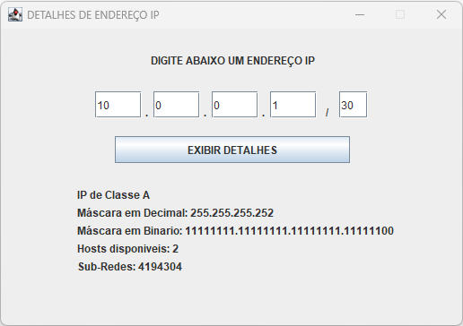

Programa com interface gráfica onde o usuário deve digitar um endereço IP com a Máscara e retornar na tela a classe que aquele IP pertence, a Máscara em padrão decimal e binário, a quantidade de hosts disponíveis para utilização e também o número de sub-redes de acordo com a classe do IP e a máscara. (Programação Orientada a Objetos).
